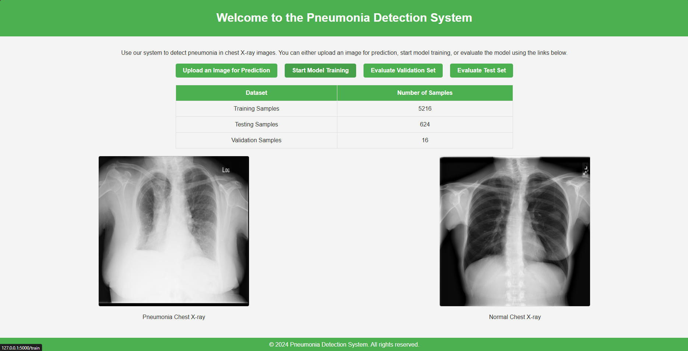

# Pneumonia Detection Using Monai

## Description

This project aims to leverage the power of deep learning and the MONAI framework to accurately detect pneumonia from chest X-ray images.
Utilizing PyTorch as the underlying framework, MONAI (Medical Open Network for AI) provides domain-optimized foundational capabilities for
developing healthcare imaging training workflows in a flexible and modular fashion. 

The goal is to create a model that can assist healthcare professionals by providing rapid and reliable pneumonia detection, potentially
improving diagnosis times and patient outcomes. This project encompasses data preprocessing, model training, and evaluation stages, 
ensuring a comprehensive approach to tackling the challenge of pneumonia detection. By automating the analysis of chest X-ray images, 
we aim to support medical practitioners in making more informed decisions, thereby enhancing the quality of care for patients.

## Installation
1. Unzip the file
2. Install all the libraries in the requirements.txt fiie
3. Open cmd and type "py app.py", it should run the program and give a link to the web
4. Navigate to the required filed of you choice which should look like this
5. open the folder and open cmd type : py app.py then it should open up the web app.




```bash
# Example command to install dependencies or set up the environment
pip install -r requirements.txt